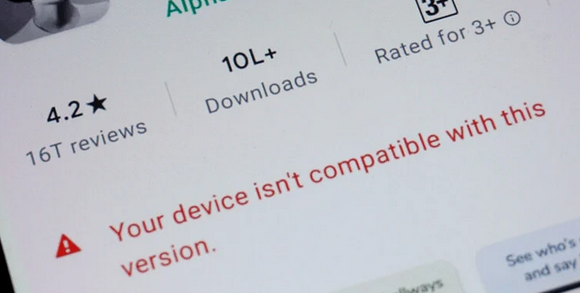
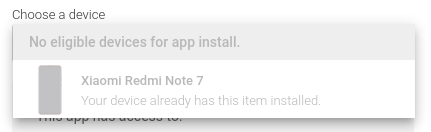
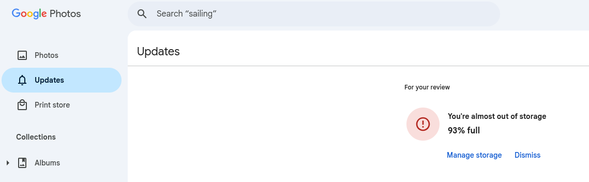
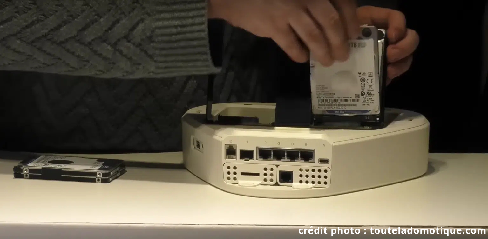
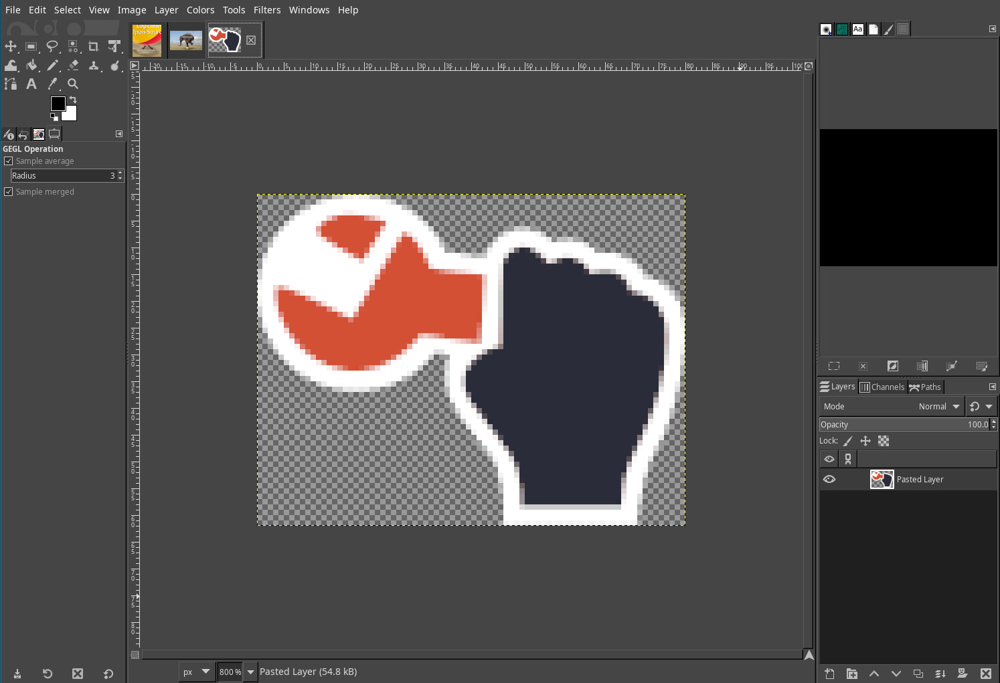
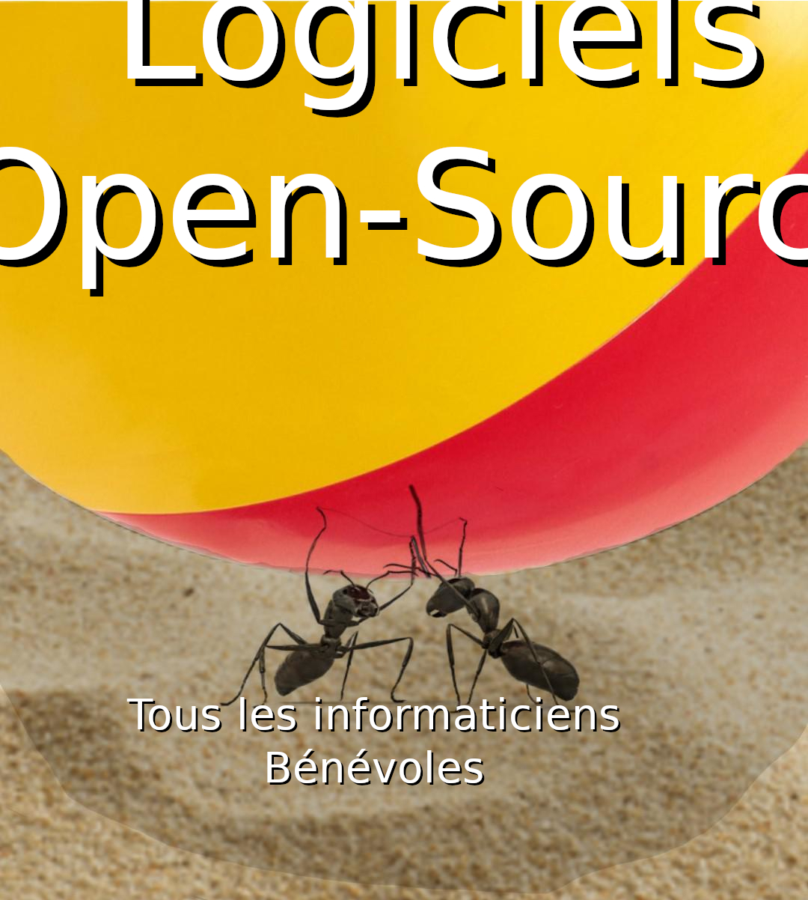

# Faire du neuf avec du vieux

Donnez une 2è jeunesse à votre ordinateur grâce à l'Opensource

Notes:

Objectif de ce talk : vous donner envie d'installer Linux sur vos vieux (et nouveaux PCs) et/ou installer des logiciels libres

---

# Plan

* C'est quoi le problème
* C'est quoi les solutions
* C'est quoi l'Opensource ?
* Conclusion

Notes:

* Ce dont nous allons parler
* Nous sommes ouverts aux questions/discussions tout au long de cette bonne heure

---

# Les problèmes

* Obsolescence programmée
  - Faire du vieux avec du neuf <!-- .element: class="fragment" data-fragment-index="1"-->
* L'économie de l'abonnement
  - L'esclavagisme économique <!-- .element: class="fragment" data-fragment-index="1"-->
* Le "Vendor Lock-in"
  - Rendre indispensable <!-- .element: class="fragment" data-fragment-index="1"-->

Notes:

* Obso progra : faire du vieux avec du neuf
* Eco abo
  - Avant : logiciel acheté à vie
  - Maintenant : on paie toute la vie
* Emprisonnement de produits
  - On rend le truc essentiel
  - On évangélise les jeunes

--

## Ça vous est déjà arrivé ?

Notes:

Quelques exemples du problème

--

> Votre matériel n'est plus supporté

- Tablette sans mise à jour, plus de youtube <!-- .element: class="fragment" -->

--

> Téléphone et application incompatibles

* Bancaire
* Média de communication avec vos proches
* Jeux en réseaux

Notes:

* Votre matériel est trop vieux : RACHETEZ-EN UN NEUF !
* Telebanking : oblige l'achat d'un téléphone récent
* WERO : obligle l'installation de l'OS constructeur
  (et oui, sur votre téléphone il y a un Operating System !)

--

> Votre stockage sur le cloud est presque plein !

* Je peux plus sauver mes photos !! 
* Je vais les perdre ... €€€€€€€€€

Notes:

* Trop de photos ? Achetez du stockage sur le cloud !
* Obligation de payer car le stockage est plein
* Au début c'est gratuit, pourtant
* Les photos sont de plus en plus grosses (course aux méga-pixels)
* Si on ne fait rien, le téléphone dysfonctionne

--

<!-- .slide: data-background-video="media/windowsupdate.mp4" data-background-video-loop="true" -->

* Mises à jour forcées <!-- .element: class="fragment" data-fragment-index="1" -->
* PC qui rame de plus en plus .... <!-- .element: class="fragment" data-fragment-index="1" -->

Notes:

* Ne sont concernés pas que les smartphones, aussi les PC !
* Mises à jour forcées
* Sécurité oui, mais...
* Si c'est pour des fonctionalités inutiles...

---

<h1>Obsolescence programmée</h1>

<!-- .slide: data-background-image="media/bfm-windows-obsolete.png" -->

Notes:

Exemples:

* TPM obligé pour Win11
* Batteries
* Connecteurs USB
* CPU ARM non suivi par android
* Ipad ou tablette non màj

--

# Obsolescence programmée <!-- .element: style="color: black" -->

<!-- .slide: data-background-image="media/png/day38-macintosh.png" -->

* Non ! Votre PC n'est pas vieux !

--

# Obsolescence programmée <!-- .element: style="color: black" -->

<!-- .slide: data-background-image="media/png/day41-desktop.png" -->
* Non ! Votre PC n'est pas inutilement inexploitable !

Notes:

Exemples:

* TPM obligé pour Win11
* Batteries
* Connecteurs USB
* CPU ARM non suivi par android
* Ipad ou tablette non màj

---

# L'économie de l'abonnement <!-- .slide: data-background-image="media/econosclavagisme.jpg" -->

Notes:

Nouveau problème de fond : le nouveau modèle économique à la mode

--

<!-- .slide: data-background-image="media/box-software.jpg" -->

Notes:

Avant, on achetait des logiciels...

--

<!-- .slide: data-background-image="media/cd-vinyl.jpg" -->

Notes:

de la musique ...

--

<!-- .slide: data-background-image="media/dvd.jpg" -->

Notes:

des films !

* Avantages
  - On paie une fois pour la vie
  - On a un joli objet pour l'étagère
  - On apprend comment ça fonctionne (vinyl)
  - Ça marche même quand ya pas internet \o/
  - Très bon marché aux vides-grenier (grâce à Deezer ;-))

--

<!-- .slide: data-background-image="media/abo.png" data-background="white" -->

Notes:

Maitenant on paie un abonnement pour tout !

* On paie tout le temps pour ne pas l'utiliser
* Musique
* Cloud
* Logiciels, exemple: Microsoft Office
  - 99% des gens utilisent 1% des fonctionalités
  - 99% des fonctionalités réellement utilisées étaient déjà présents en 1983

--

<!-- .slide: data-background-image="media/flix.png" -->

Notes:

Même pour les films

* Payer pour les films qu'on a déjà vu 3 fois
  - ou qu'on ne peut plus voir car ils ont disparus de la plateforme
* Suggestions soit-disant algorithmiques
* Un abonnement ne suffit pas ! Chaque plateforme a des contrats d'exclusivité
* Le "Cloud" est scindé !

--

<!-- .slide: data-background-image="media/cd-vinyl.jpg" -->

* CDs, Vinyles <!-- .element: class="fragment" -->

Notes:

* Avantages
  - On paie une fois pour la vie
  - On a un joli objet pour l'étagère
  - On apprend comment ça fonctionne (vinyl)
  - Très bon marché aux vides-grenier (grâce à Deezer ;-))

--

<!-- .slide: data-background-image="media/cloud.jpg" -->

 <!-- .element: class="fragment" -->

Notes:

Rappel : le cloud n'existe pas

* Pour google drive et compagnie
* Autant utiliser le sien : NAS
* ammortissement 

---

# L'Opensource <!-- .slide: data-background-image="media/opensource.png" size=50%-->

* Gratuité (pour l'utilisateur lambda)
* Transparence (certaines)
* Binaire + Source 
  - Disponible
  - Analysable (mode d'emploi)

Notes:

(pas toujours)

Pour les logiciels, l'opensource va nous sauver !

> Mais c'est quoi exactement ?

--

<!-- .slide: data-background-iframe="https://fr.wikipedia.org/wiki/Logiciel_libre" data-background-interactive="true" data-preload -->

Notes:

Voici la définition de l'open-source selon wikipedia

--

<!-- .slide: data-background-image="media/dependency_2x.png" data-background-size="contain" -->

--

<!-- .slide: data-background-image="media/tech-drawing.jpg, media/kicad.png" -->

Notes:

Si on compare le logiciel libre à un objet industriel

* Contrairement à une boîte noire
* On a les plans
* les cotes exactes
* les notices

--

<!-- .slide: data-background-image="media/kicad.png" -->

Notes:

Si on compare le logiciel libre à un objet électronique

* On a le plan détaillé du circuit
* les pistes
* les couches
* les composants
* le schéma électrique

---

# Les solutions

--

## Alternatives Logicielles

--

### Gimp

---

<!-- .slide: data-background-image="media/elephant-annote.jpg" -->

<!-- .element: class="fragment" style="height: 60vh" -->

