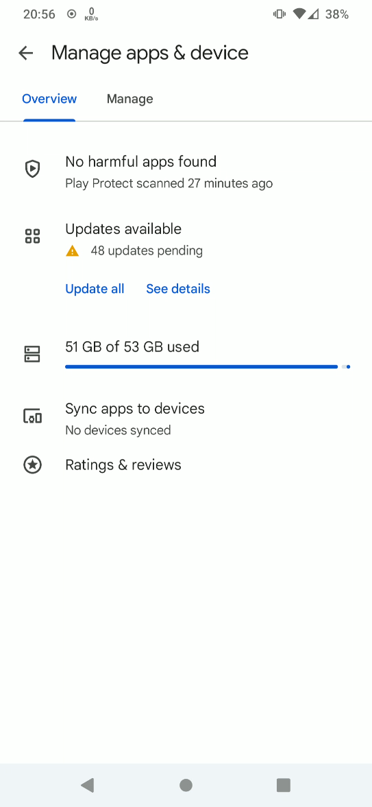
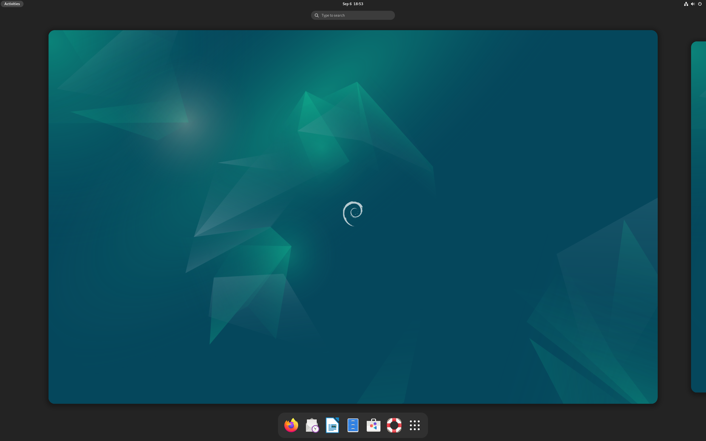
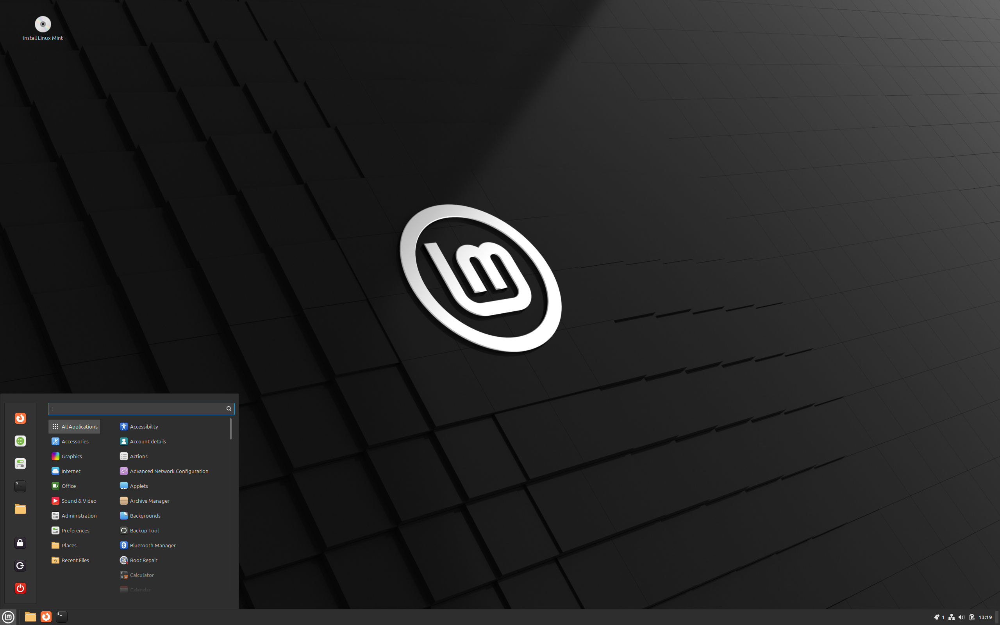
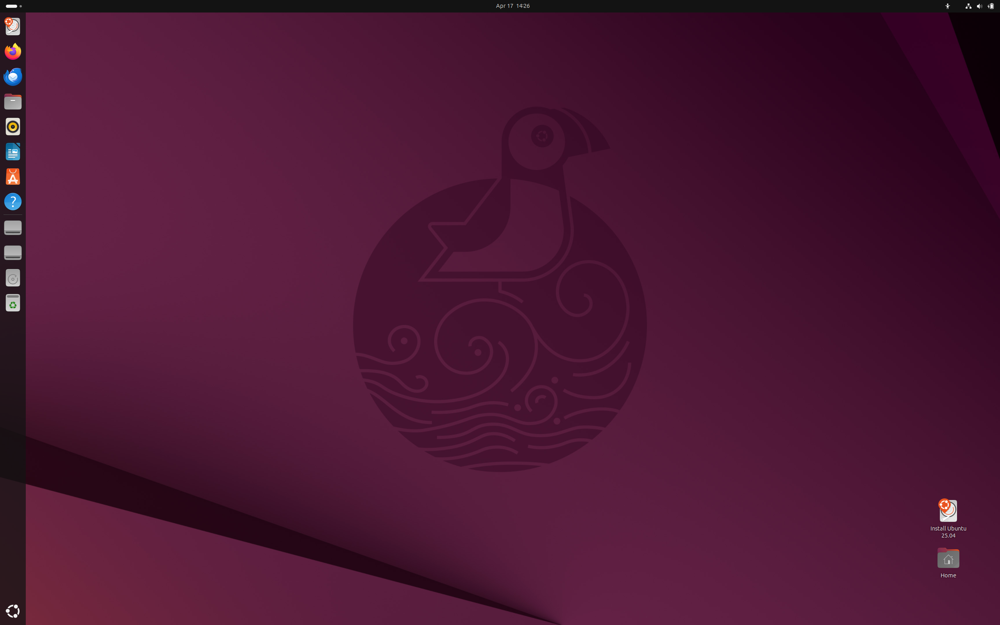
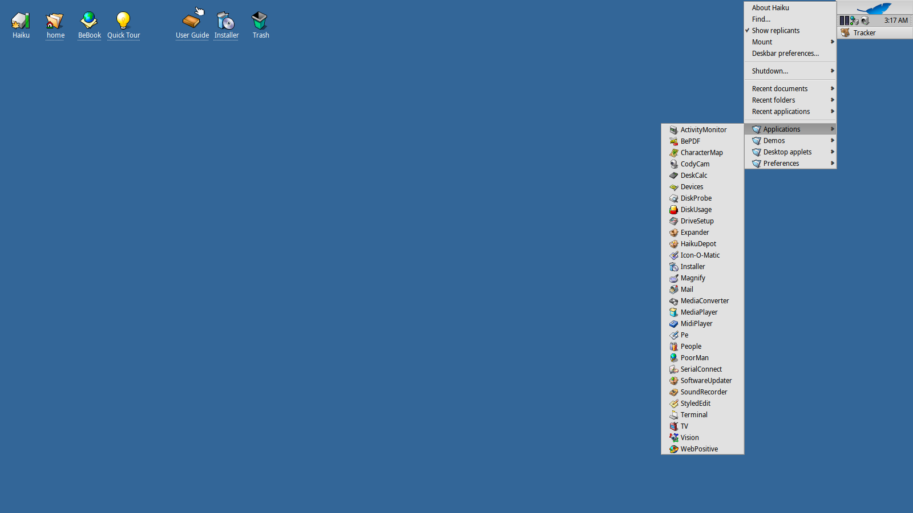
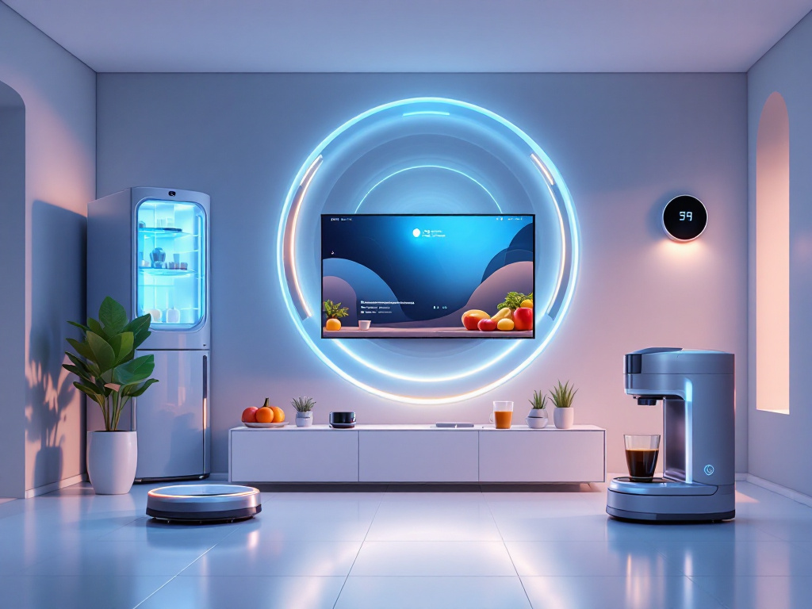

# Faire du neuf avec du vieux

Donnez une 2è jeunesse à votre ordinateur grâce à l'Opensource

Notes:

Objectif de ce talk : vous donner envie d'installer Linux sur vos vieux (et nouveaux PCs) et/ou installer des logiciels libres

---

# Plan

* C'est quoi le problème
* C'est quoi les solutions
* C'est quoi l'Opensource ?
* Conclusion

Notes:

* Ce dont nous allons parler
* Nous sommes ouverts aux questions/discussions tout au long de cette bonne heure

---

# Les problèmes <!-- .slide: data-autoslide="1" -->

* L'obsolescence programmée
  - Faire du vieux avec du neuf <!-- .element: class="fragment" data-fragment-index="1" style="color: orange !important;text-shadow: black 2px 2px;" data-autoslide="1" -->
* L'économie de l'abonnement
  - L'esclavagisme économique <!-- .element: class="fragment" data-fragment-index="2" style="color: orange !important;text-shadow: black 2px 2px;" data-autoslide="1" -->
* Le "Vendor Lock-in"
  - Rendre indispensable <!-- .element: class="fragment" data-fragment-index="3" style="color: orange !important;text-shadow: black 2px 2px;" data-autoslide="5000" -->

Notes:

* Obso progra : faire du vieux avec du neuf
* Eco abo
  - Avant : logiciel acheté à vie
  - Maintenant : on paie toute la vie
* Emprisonnement de produits
  - On rend le truc essentiel
  - On évangélise les jeunes

--

## Ça vous est déjà arrivé ?

Notes:

Quelques exemples du problème

--

> Votre matériel n'est plus supporté

- Tablette sans mise à jour, plus de youtube <!-- .element: class="fragment" style="color: orange !important;text-shadow: black 2px 2px;" -->

Notes:

* Matériel fonctionne parfaitement
* Logiciel ne fonctionne plus

--

> Téléphone et application incompatibles

* Bancaire <!-- .element: class="fragment" data-fragment-index="1" style="color: orange !important;text-shadow: black 2px 2px;" -->
* Média de communication avec vos proches <!-- .element: class="fragment" data-fragment-index="1" style="color: orange !important;text-shadow: black 2px 2px;" -->
* Jeux en réseaux <!-- .element: class="fragment" data-fragment-index="1" style="color: orange !important;text-shadow: black 2px 2px;" -->

Notes:

* Votre matériel est trop vieux : RACHETEZ-EN UN NEUF !
* Telebanking : oblige l'achat d'un téléphone récent
* WERO : obligle l'installation de l'OS constructeur
  (et oui, sur votre téléphone il y a un Operating System !)

--

> Votre stockage sur le cloud est presque plein !

* Je peux plus sauver mes photos !! <!-- .element: class="fragment" data-fragment-index="1" style="color: orange !important;text-shadow: black 2px 2px;" -->
* Je vais les perdre ... €€€€€€€€€ <!-- .element: class="fragment" data-fragment-index="1" style="color: orange !important;text-shadow: black 2px 2px;" -->

Notes:

* Trop de photos ? Achetez du stockage sur le cloud !
* Obligation de payer car le stockage est plein
* Au début c'est gratuit, pourtant
* Les photos sont de plus en plus grosses (course aux méga-pixels)
* Si on ne fait rien, le téléphone dysfonctionne

---

# Obsolescence programmée

<!-- .slide: data-background-image="media/bfm-windows-obsolete.png" -->

Notes:

* Problème de fond : on veut que vous rachetiez du neuf
* Exemples:
  * TPM obligé pour Win11
  * Batteries
  * Connecteurs USB
  * CPU ARM non suivi par android
  * Ipad ou tablette non màj

--

* Non ! Votre PC n'est pas vieux !
* Non ! Votre PC n'est pas plus lent qu'avant !

Notes:

* Les ordis ne ralentissent pas avec le temps
* C'est les logiciels qui sont de plus en plus gourmands
* Bon OK des fois il faut remplacer le ventilateur, la batterie ou la pile bouton
* Le Repair-Café est là pour ça !

--

* Non ! Votre PC n'est pas inutilement inexploitable !

Notes:

Exemples:

* TPM obligé pour Win11
* Batteries
* Connecteurs USB
* CPU ARM non suivi par android
* Ipad ou tablette non màj

--

<!-- .slide: data-background-video="media/windowsupdate.mp4" data-background-video-loop="true" -->

* Mises à jour forcées <!-- .element: class="fragment" data-fragment-index="1" -->
* PC qui rame de plus en plus .... <!-- .element: class="fragment" data-fragment-index="1" -->

Notes:

* Ne sont concernés pas que les smartphones, aussi les PC !
* Mises à jour forcées
* Sécurité oui, mais...
* Si c'est pour des fonctionalités inutiles...

--

Notes:

* Mises à jour constantes
* Au bout d'une semaine toutes les applis se mettent à jour environ

---

# L'économie de l'abonnement <!-- .slide: data-background-image="media/econosclavagisme.jpg" -->

Notes:

Nouveau problème de fond : le nouveau modèle économique à la mode

--

<!-- .slide: data-background-image="media/box-software.jpg" -->

Notes:

Avant, on achetait des logiciels...

--

<!-- .slide: data-background-image="media/cd-vinyl.jpg" -->

Notes:

de la musique ...

--

<!-- .slide: data-background-image="media/dvd.jpg" -->

Notes:

des films !

* Avantages
  - On paie une fois pour la vie
  - On a un joli objet pour l'étagère
  - On apprend comment ça fonctionne (vinyl)
  - Ça marche même quand ya pas internet \o/
  - Très bon marché aux vides-grenier (grâce à Deezer ;-))

--

<!-- .slide: data-background-image="media/abo.png" -->

Notes:

Maitenant on paie un abonnement pour tout !

* On paie tout le temps pour ne pas l'utiliser
* Musique
* Cloud
* Logiciels, exemple: Microsoft Office
  - 99% des gens utilisent 1% des fonctionalités
  - 99% des fonctionalités réellement utilisées étaient déjà présents en 1983

--

<!-- .slide: data-background-image="media/flix.png" -->

Notes:

Même pour les films

* Payer pour les films qu'on a déjà vu 3 fois
  - ou qu'on ne peut plus voir car ils ont disparus de la plateforme
* Suggestions soit-disant algorithmiques
* Un abonnement ne suffit pas ! Chaque plateforme a des contrats d'exclusivité
* Le "Cloud" est scindé !

--

<!-- .slide: data-background-image="media/cloud.jpg" -->

 <!-- .element: class="fragment" -->

Notes:

Rappel : le cloud n'existe pas

* Pour google drive et compagnie
* Autant utiliser le sien : NAS
* ammortissement 

--

> On n'achète plus les logiciels, les films et les albums, mais le droit de les utiliser

> Si c'est gratuit, c'est toi le produit !

---

# L'Opensource <!-- .slide: data-background-image="media/opensource.png" size=50%-->

* Gratuité (pour l'utilisateur lambda)
* Transparence (certaines)
* Binaire + Source 
  - Disponible
  - Analysable (mode d'emploi)
* ≠ Logiciels privateurs / propriétaires

Notes:

(pas toujours)

Pour les logiciels, l'opensource va nous sauver !

> Mais c'est quoi exactement ?

--

<!-- .slide: data-background-iframe="https://fr.wikipedia.org/wiki/Logiciel_libre"  data-preload -->

https://fr.wikipedia.org/wiki/Logiciel_libre<!-- .element: style="color: orange !important;text-shadow: black 2px 2px;" -->

Notes:

Voici la définition de l'open-source selon wikipedia

--

<!-- .slide: data-background-image="media/tech-drawing.jpg, media/kicad.png" -->

Notes:

Si on compare le logiciel libre à un objet industriel

* Contrairement à une boîte noire
* On a les plans
* les cotes exactes
* les notices

--

<!-- .slide: data-background-image="media/kicad.png" -->

Notes:

Si on compare le logiciel libre à un objet électronique

* On a le plan détaillé du circuit
* les pistes
* les couches
* les composants
* le schéma électrique

--

<!-- .slide: data-background-image="media/dependency_2x.png" data-background-size="contain" -->

Notes:

* Des fois tout dépend d'un petit composant logiciel
* Si ce-dernier casse, tout tombe
* Chateau de cartes

--

<!-- .slide: data-background-image="media/elephant-annote.jpg" -->

<!-- .element: class="fragment" style="height: 60vh" -->

Notes:

Une autre manière de voir cette image
* Oui c'est déjà arrivé cf. nodejs

---

# Les solutions

--

## Alternatives Logicielles

--

### Gimp

Notes:

* Photoshop libre
* L'un des exemples phares

--

### Pour Chaque logiciel privateur plus d'une alternative libre

* Système d'exploitation <!-- .element: class="fragment" data-autoslide="1" -->
* Navigateur, messageries courriel <!-- .element: class="fragment" data-autoslide="1" -->
* Retouche/galerie photos <!-- .element: class="fragment" data-autoslide="1" -->
* Lecteur musique/video <!-- .element: class="fragment" data-autoslide="1" -->
* Bureautique <!-- .element: class="fragment" data-autoslide="1" -->
* Sauvegarde <!-- .element: class="fragment" data-autoslide="1" -->
* Visio-conférence <!-- .element: class="fragment" data-autoslide="1" -->
* Jeux <!-- .element: class="fragment" data-autoslide="1" -->
* ... <!-- .element: class="fragment" data-autoslide="5000" -->

Notes:

Il existe toujours une alternative

--

### la liste est vraiment longue<!-- .element: style="color: black !important;text-shadow: 0 0px 0px;" -->

<!-- .slide: data-background-iframe="https://fr.wikipedia.org/wiki/Correspondance_entre_logiciels_libres_et_logiciels_propri%C3%A9taires"  data-preload --><!-- .element: class="fragment" -->

https://fr.wikipedia.org/wiki/Correspondance_entre_logiciels_libres_et_logiciels_propri%C3%A9taires<!-- .element: style="color: black !important;text-shadow: 0 0px 0px;" -->

Notes:

La liste est longue mais l'on trouve beaucoup de ressources en ligne

--

### pour s'y retrouve<!-- .element: style="color: orange !important;text-shadow: black 2px 2px;" -->r

<!-- .slide: data-background-iframe="https://framalibre.org/" data-preload -->

https://framalibre.org<!-- .element: style="color: orange !important;text-shadow: black 2px 2px;" -->/

Notes:

* Framasoft = réseau d'éducation populaire
* Consacré principalement au logiciel libre
* Soutenu depuis 2004 par l'asso éponyme
* Créé en novembre 2001 par Alexis Kauffmann, Paul Lunetta, et Georges Silva
* 3 axes
  - Promotion, Diffusion et Développement de logiciels libres
  - Enrichissement de la culture libre
  - Offre de services libres en ligne

--

<!-- .slide: data-background-iframe="https://distrowatch.com/?language=FR"  data-preload -->

Système d'exploitation = OS = Operating System <!-- .element: style="color: orange !important;text-shadow: black 2px 2px;" -->

Windows vs Linux <!-- .element: style="color: orange !important;text-shadow: black 2px 2px;" -->

(Ubuntu, Debian, Gentoo, Slackware, Suse, ...) <!-- .element: style="color: orange !important;text-shadow: black 2px 2px;" -->

Notes:

* distrowatch est un annuaire d'OS libres

--

### Linux debian

Notes:

La distribution GNU/Linux la plus ancienne

--

### Linux mint

Notes:

La distribution appréciée par les anciens Windowsiens

--

### Linux ubuntu

Notes:

La distribution appréciée par la majorité des utilisateurs de desktop

--

### haiku

Notes:

* Ce n'est pas Linux
* Digne successeur de BeOS

--

## Alternatives logicielles pour les smartphones

<!-- .slide: data-background-iframe="https://lesbases.anct.gouv.fr/ressources/les-os-de-smartphones-degooglises" data-preload -->

https://lesbases.anct.gouv.fr/ressources/les-os-de-smartphones-degooglises <!-- .element: style="color: orange !important;text-shadow: black 2px 2px;" -->

Notes:

* OS libres
* LiberaOS
* /e/

---

## Alternatives Matérielles

--

### Fairphone <!-- .element: style="color: orange !important;text-shadow: black 2px 2px;" -->

<!-- .slide: data-background-iframe="https://shop.fairphone.com/fr/fairphone-5" data-preload -->

https://shop.fairphone.com/fr/fairphone-5 <!-- .element: style="color: orange !important;text-shadow: black 2px 2px;" -->

Notes:

* Téléphone réparable
* Garantie mise à jour logicielle 10 ans
* Garantie pièces détachées longue durée

--

### Indice de réparabilité

<!-- .slide: data-background-iframe="https://www.indicereparabilite.fr/appareils/multimedia/ordinateur-portable/"  data-preload -->

https://www.indicereparabilite.fr/appareils/multimedia/ordinateur-portable/ <!-- .element: style="color: orange !important;text-shadow: black 2px 2px;" -->

Notes:

* Le Repair Café vous remercie si vous achetez un ordinateur facilement réparable

--

### Vérifier s'il existe des tutos

<!-- .slide: data-background-iframe="https://fr.ifixit.com/"  data-preload -->

https://fr.ifixit.com/ <!-- .element: style="color: orange !important;text-shadow: black 2px 2px;" -->

Notes:

* Le Repair Café adore les tutos

--

### Dégooglisons internet ! <!-- .element: style="color: white !important;text-shadow: black 2px 2px;" -->

<!-- .slide: data-background-iframe="https://degooglisons-internet.org/fr/"  data-preload -->

https://degooglisons-internet.org/fr/ <!-- .element: style="color: orange !important;text-shadow: black 2px 2px;" -->

Notes:

* Ma vie privée est privée

--

### même le gouvernement nous y incite <!-- .element: style="color: orange !important;text-shadow: black 2px 2px;" -->

<!-- .slide: data-background-iframe="https://lesbases.anct.gouv.fr/ressources/webinaire-adopter-des-outils-ethiques-dans-mon-association"  data-preload -->

https://lesbases.anct.gouv.fr/ressources/webinaire-adopter-des-outils-ethiques-dans-mon-association <!-- .element: style="color: orange !important;text-shadow: black 2px 2px;" -->

Notes:

* Ne partageons pas tout non plus !

--

<!-- .slide: data-background-iframe="https://framatube.org/w/1XzQFwBU735v85UmEo2FgL" -->

Notes:

* Webinaire framasoft sur l'utilisation éthique de l'outil informatique
* On vous conseille

---

### Le futur sera-t-il Opensource ?

Notes:

* Le futur nous réserve des surprises
* Voulons-nous jeter notre électroménager car il n'y a plus de mises à jour ?

--

Lien vers cette présentation :

Notes:

SCANNEZ-MOI !

--

<!-- .slide: data-background-iframe="https://repaircafe-rhone.fr/#services"  data-preload data-autoslide="15000" -->

